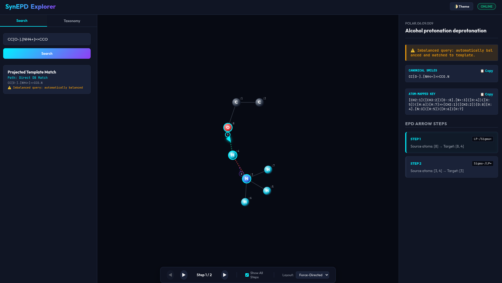

# SynEPD
Electron Pushing Database - Hierarchical mechanistic reaction templates.



👉 **[View Future Architecture & UI Plan](plan/sprint/sprint_5_future_architecture.html)**
👉 **[Sprint 1 Plan](plan/sprint/sprint_1.html)** | **[Sprint 2 Plan](plan/sprint/sprint_2.html)** | **[Sprint 3 Plan](plan/sprint/sprint_3.html)** | **[Sprint 4 Plan](plan/sprint/sprint_4.html)**

## Database Architecture

SynEPD provides a highly normalized, scalable SQLite relational database for extremely fast querying of reaction components, taxonomy, reaction center graphs, and electron-pushing descriptors.


## Construction & Precheck Pipeline

Before a case is allowed into the DB, it passes through the strict `synepd.precheck` pipeline to ensure reaction balance, atom-map equality, and explicit hydrogen completeness. Invalid structures are aggressively dropped. 

To build the release database from the validated JSON:

```python
from pathlib import Path
from synepd.construct.build_release_db import build_release_database

build_release_database(
    json_path=Path("data/synepd_v0_1_0_cases_full.json"),
    hierarchy_path=Path("data/synepd_v0_1_0_hierarchy.md"),
    db_path=Path("release/synepd.sqlite")
)
```

## Data Distribution & Installation

SynEPD can be packaged and distributed via PyPI (`pip install`) while hosting the large database files on **Zenodo** with a persistent, citable DOI. 

When a user calls the query API, it automatically downloads and caches the database file locally under `~/.cache/synepd/`.

### Installation
```bash
pip install synepd
```

### Querying Data (Scenario 1 & 2 Examples)

Below are detailed examples demonstrating the two main query scenarios using python:

#### Scenario 1: Find Reactions by Template
Find all reactions in the database that share the same reaction center template graph (e.g. simple proton transfer):

```python
from pathlib import Path
from synepd.core import find_reactions_by_template

db_path = Path("release_v1.sqlite")

# Mapped proton transfer template reaction SMILES
template_smiles = '[H:2][NH3+:3].[O-:1][CH3:4]>>[NH3:3].[O:1]([H:2])[CH3:4]'
reactions = find_reactions_by_template(template_smiles, db_path=db_path)

print(f"Found {len(reactions)} reactions matching the template.")
for rxn in reactions[:3]:
    print(f"  - Case ID: {rxn['case_id']}")
    print(f"    Name: {rxn['name']}")
    print(f"    SMILES: {rxn['canonical_rsmi']}")
```

#### Scenario 2: Query EPD by Reaction SMILES
Query electron pushing descriptors (EPD arrows) for mapped, unmapped, balanced, or imbalanced reaction SMILES:

```python
from pathlib import Path
from synepd.core import query_epd_by_reaction

db_path = Path("release_v1.sqlite")

scenarios = {
    "2a. Mapped Existing": "[CH3:1][CH2:2][O-:3].[N+:4]([H:5])([H:6])([H:7])[H:8]>>[CH3:1][CH2:2][O:3][H:5].[N:4]([H:6])([H:7])[H:8]",
    "2b. Mapped New (Projected)": "[CH3:1][CH2:2][CH2:3][O-:4].[NH3+:5][H:6]>>[CH3:1][CH2:2][CH2:3][O:4][H:6].[NH3:5]",
    "2c. Unmapped Existing": "CC[O-].[NH4+]>>CCO.N",
    "2d. Unmapped New (Projected)": "CCC[O-].[NH4+]>>CCCO.N",
    "2e. Imbalanced (Auto-balanced)": "CC[O-].[NH4+]>>CCO"
}

for name, rsmi in scenarios.items():
    print("=" * 60)
    print(f"Scenario {name}")
    print(f"Query reaction: {rsmi}")
    res = query_epd_by_reaction(rsmi, db_path=db_path)
    print(f"Success: {res.get('success')}")
    if res.get("success"):
        print(f"Path taken: {res.get('path')} (1=direct, 2=projection)")
        print(f"Name: {res.get('name')}")
        print(f"Balanced/Mapped SMILES: {res.get('mapped_rsmi')}")
        print("EPD Arrows:")
        for arrow in res.get("arrows", []):
            print(f"  Arrow {arrow['arrow_index']} [{arrow['arrow_type_code']}]: {arrow['source_atoms']} -> {arrow['target_atoms']}")
    else:
        print(f"Error: {res.get('error')}")
```

---

## Developer Publishing Guide (Registration Steps)

To share this package with the world, follow these registration and publishing steps:

### 1. Host the SQLite Database on Zenodo
1. Sign up/Log in on [Zenodo](https://zenodo.org/) (you can use your GitHub or ORCID account).
2. Click **New Upload**.
3. Upload `release_v1.sqlite`.
4. Fill in metadata (Title: *SynEPD Database*, Authors, Description, and License).
5. Click **Publish**. Zenodo will instantly generate a persistent **DOI** (e.g. `10.5281/zenodo.XXXXXXX`).
6. Update `DEFAULT_ZENODO_RECORD_ID` in `synepd/core/data.py` with your new Zenodo Record ID.

### 2. Publish the Python Package on PyPI
1. Register a free account on [PyPI](https://pypi.org/) and set up 2-Factor Authentication (2FA).
2. Generate an API token in your PyPI Account Settings.
3. Build and upload your package:
   ```bash
   # Build the distribution packages
   python -m build
   
   # Upload to PyPI using twine
   python -m twine upload dist/*
   ```
4. Users can now run `pip install synepd` and immediately query your database!


## License

This project is licensed under MIT License - see the [License](LICENSE) file for details.

## Acknowledgments

This project has received funding from the European Unions Horizon Europe Doctoral Network programme under the Marie-Skłodowska-Curie grant agreement No 101072930 ([TACsy](https://tacsy.eu/) -- Training Alliance for Computational)