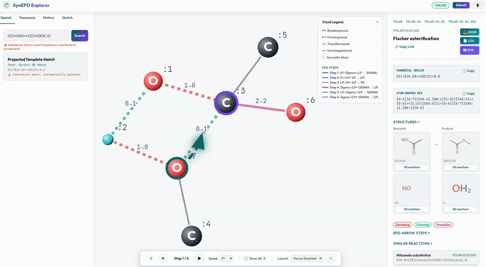
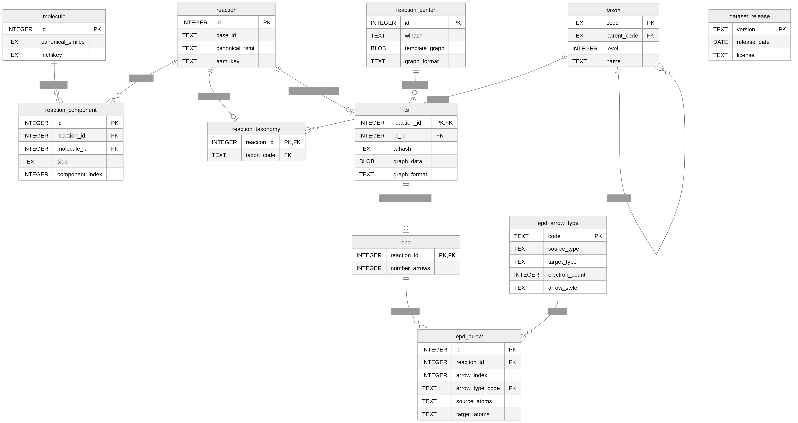

# SynEPD

SynEPD is a hierarchical electron-pushing database for polar organic reaction mechanisms. It combines clean reaction records, a POLAR taxonomy, reaction-center templates, atom-mapped reaction graphs, and electron-pushing diagram (EPD) arrows in a local SQLite database with a web explorer.

Official web server: https://synepd.bioinf.uni-leipzig.de

Zenodo release: https://zenodo.org/records/21235892

<p align="center">
  
</p>

## Current Data

The current local build uses the cleaned POLAR dataset:

| Item | Count |
| --- | ---: |
| Curated records | 1,915 |
| Database reactions | 1,915 |
| RC templates | 1,497 |
| EPD arrows | 7,303 |
| Mechanism contexts | 1,915 |
| Taxon rows | 1,051 |
| Molecules | 2,179 |

Important files:

| Path | Purpose |
| --- | --- |
| `data/polar.json` | Clean reaction records, IDs starting at 1 |
| `data/hierarchy.md` | Clean hierarchy consumed by the database builder 
| `data/epdb.sqlite` | Built SQLite database used by the app |
| `data/release-manifest.json` | Current artifact checksums, semantic version, and counts |

## Environment

Create or update the Conda environment:

```bash
conda env create -f env.yaml
conda activate synepd
```

For an existing environment:

```bash
conda activate synepd
python -m pip install -r requirements.txt
```

The project metadata lives in `pyproject.toml`. Runtime dependencies are declared there, and developer tools are available through the `dev` extra:

```bash
python -m pip install -e ".[dev]"
```

## Build The Data


Build the SQLite database:

```bash
PYTHONPATH=. python synepd/construct/build_release_db.py
```

The builder writes `data/epdb.sqlite`.

Verify the checked-in artifact against its release manifest:

```bash
python -m synepd.construct.release_manifest data/epdb.sqlite \
  --verify data/release-manifest.json
```

## Run The Explorer

Use the hosted explorer at:

```text
https://synepd.bioinf.uni-leipzig.de
```

For local development, start the app with:

```bash
./run_server.sh
```

Open:

```text
http://127.0.0.1:8000/
```

Stable service routes are exposed under `/api/v1`; the original `/api`
routes remain compatibility aliases for v0.1 clients.

By default the server reads:

```bash
SYNEPD_DATABASE_URL=data/epdb.sqlite
```

To use another database:

```bash
SYNEPD_DATABASE_URL=/path/to/other.sqlite ./run_server.sh
```

## Query Examples

Find reactions that share a reaction-center template:

```python
from pathlib import Path
from synepd.core import find_reactions_by_template

db_path = Path("data/epdb.sqlite")
template_smiles = "[H:2][NH3+:3].[O-:1][CH3:4]>>[NH3:3].[O:1]([H:2])[CH3:4]"

reactions = find_reactions_by_template(template_smiles, db_path=db_path)
print(f"Found {len(reactions)} matching reactions")
```

Query EPD arrows by reaction SMILES:

```python
from pathlib import Path
from synepd.core import query_epd_by_reaction

db_path = Path("data/epdb.sqlite")
rsmi = "CC[O-].[NH4+]>>CCO"

result = query_epd_by_reaction(rsmi, db_path=db_path)
print(result["success"])
print(result.get("path"))
for arrow in result.get("arrows", []):
    print(arrow["arrow_index"], arrow["arrow_type_code"], arrow["source_atoms"], "->", arrow["target_atoms"])
```

Query directly from a published release on Zenodo:

```python
from synepd.core import query_epd_by_reaction

rsmi = "CC[O-].[NH4+]>>CCO"
result = query_epd_by_reaction(
    rsmi,
    db_source="zenodo",
    db_version="0.1.0",  # latest configured Zenodo record until v0.2 is published
)
```

Use the matching GitHub Release asset instead (with a tag-archive fallback):

```python
from synepd.core import get_default_db_path

db_path = get_default_db_path(version="0.1.0", source="github")
```

For a portable client, prefer Zenodo and fall back to the matching GitHub
release automatically:

```python
result = query_epd_by_reaction(
    rsmi,
    db_source="auto",
    db_version="0.1.0",
)
```

## Checks

Useful focused checks:

```bash
python -m py_compile synepd/core/ingest.py synepd/construct/build_release_db.py synepd/web/server.py
python -m pytest -q test/construct/test_build_release_db.py test/database/test_database_models.py
python -m pip check
```

## Database Architecture

SynEPD v0.2 stores 1,915 reactions, 1,497 chemistry-aware reaction-center
templates, 7,303 EPD arrows, ITS graphs, and one materialized mechanistic
context per reaction in a normalized SQLite database. Mechanistic contexts
combine an ITS-derived anchor graph with ordered transition and transient-edge
events.



## Publishing Notes

The 0.1.0 release is archived on Zenodo at https://zenodo.org/records/21235892.
For future releases, add the new Zenodo record ID to `ZENODO_RECORD_IDS` in
`synepd/core/data.py`. The package itself can then be built and uploaded with:

```bash
python -m build
python -m twine upload dist/*
```

## License

The software is licensed under the Apache License 2.0. The curated data
release is distributed under CC BY 4.0 where stated in the release metadata.
See [LICENSE](LICENSE) for the software license text.

## Acknowledgments

This project has received funding from the European Union's Horizon Europe Doctoral Network programme under the Marie Skłodowska-Curie grant agreement No. 101072930 ([TACsy](https://tacsy.eu/) -- Training Alliance for Computational Systems Chemistry).
