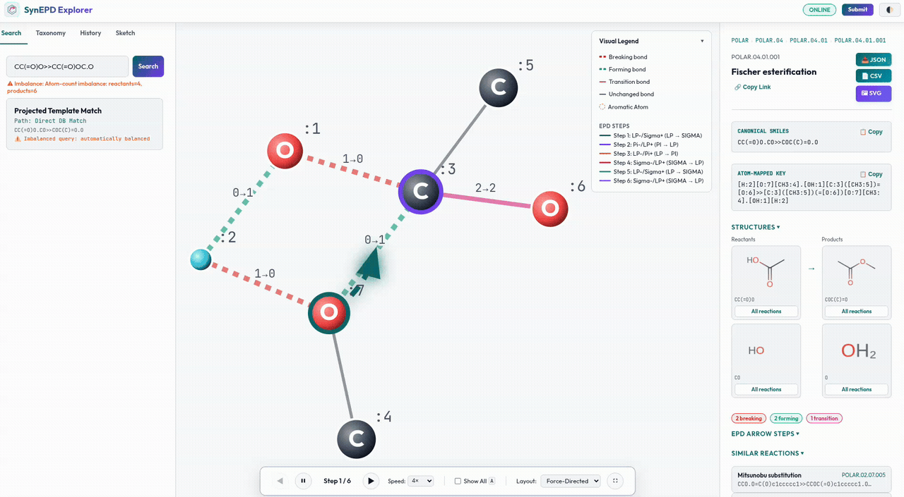

# SynEPD

SynEPD is a hierarchical database of polar organic reaction mechanisms. It
combines curated atom-mapped reactions, the POLAR taxonomy, reaction-center
(RC) and mechanistic-center (MC) templates, ITS graphs, and ordered
electron-pushing diagram (EPD) arrows in SQLite and a web explorer.

- [Web explorer](https://synepd.bioinf.uni-leipzig.de)
- [Zenodo releases](https://doi.org/10.5281/zenodo.21235891)
- [Documentation](docs/source/index.rst)

<p align="center">
  
</p>

## Dataset

| Item | Count |
| --- | ---: |
| Reactions | 1,926 |
| Molecules | 2,277 |
| RC templates | 1,521 |
| MC templates | 1,540 |
| EPD arrows | 8,123 |
| Taxonomy classes | 939 |
| Accepted RXNO/MOP links | 218 |

An RC describes changed bonds. An MC extends its RC with the transition edges
required by the curated electron flow. In the current release, 284 MC
templates (18.44%) differ from their RC and 229 (14.87%) structurally extend
it.

The corpus covers closed-shell, paired-electron mechanisms. Concerted
reactions are included when their electron movement is expressible with
two-electron arrows. Radical and single-electron-transfer mechanisms are
excluded because the current vocabulary has no fishhook-arrow representation.

## Quick Start

Create the Conda environment and install the package:

```bash
conda env create -f env.yaml
conda activate synepd
python -m pip install -e ".[dev]"
```

Start the local explorer:

```bash
./run_server.sh
```

Then open <http://127.0.0.1:8000/>. Versioned API routes are available under
`/api/v1`; `/api` remains as a compatibility alias.

## Query from Python

```python
from synepd.query import SynEPDQuery

with SynEPDQuery("data/epdb.sqlite") as query:
    result = query.epd("CC[O-].[NH4+]>>CCO")
    for arrow in result.get("arrows", []):
        print(
            arrow["arrow_index"],
            arrow["arrow_type_code"],
            arrow["source_atoms"],
            "->",
            arrow["target_atoms"],
        )
```

The same interface supports molecule, taxonomy, arrow-sequence, RC-template,
ITS/RC/MC, and RXNO/MOP queries. `SynEPDQuery.from_release(...)` resolves a
tagged release through the `zenodo`, `github`, or `auto` sources.

## Build and Validate the Data

Build the release database:

```bash
PYTHONPATH=. python -m synepd.construct.build_release_db
```

Rebuild or check the external RXNO/MOP linkage:

```bash
python scripts/build_rxno_mapping.py --obo data/rxno.obo
python scripts/build_rxno_mapping.py --check --obo data/rxno.obo
```

Verify the checked-in release artifact:

```bash
python -m synepd.construct.release_manifest data/epdb.sqlite \
  --verify data/release-manifest.json
```

Core release files are:

| Path | Purpose |
| --- | --- |
| `data/polar.json` | Curated production reaction records |
| `data/hierarchy.md` | POLAR taxonomy source |
| `data/epdb.sqlite` | Built read-only release database |
| `data/rxno_crosswalk.tsv` | SynEPD-to-RXNO/MOP linkage |
| `data/release-manifest.json` | Version, counts, and checksums |
| `synepd/web/static/data_arch.tex` | Editable database diagram source |

SQLite contains the reaction, molecular, taxonomy, RC, MC, ITS, and EPD core.
RXNO/MOP mappings remain versioned TSV/RDF artifacts and are resolved on
demand instead of being duplicated in SQLite. Narrative curation notes and
internal named-reaction relations are not exposed through the public schema.

## Development Checks

```bash
python -m black --check --workers 1 synepd test
./lint.sh
./pytest.sh
python -m synepd.precheck.epd_verification --strict
```

For a multi-worker deployment, run `./run_server.sh run --no-reload --workers
4` behind a reverse proxy. The bundled SQLite release is opened read-only;
PostgreSQL is supported for horizontally scaled or write-heavy deployments.

## License and Acknowledgment

The software is licensed under Apache License 2.0. Curated release data is
distributed under CC BY 4.0 where stated in its metadata. See
[LICENSE](LICENSE).

This project received funding from the European Union's Horizon Europe
Doctoral Network programme under Marie Skłodowska-Curie grant agreement No.
101072930 ([TACsy](https://tacsy.eu/)).
